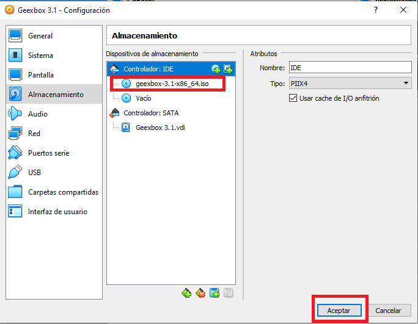

#  <b>Máquina Virtual </b>

<cite style="display:block; text-align: justify">Una máquina virtual es un software que crea una capa independiente donde se emula el funcionamiento de un ordenador real con todos los componentes de hardware que necesita para funcionar (disco duro, memoria RAM, tarjetas de red, tarjeta gráfica, etc.) y que puede ejecutar cualquier sistema operativo o programa, tal y como lo haría un ordenador real. Toda esta emulación se encapsula en una serie de archivos que actúan como contendor desde el que se ejecuta la máquina virtual en una ventana de tu ordenador como si de un programa más se tratara y sin que nada de lo que suceda en el interior de esa ventana afecte al ordenador que la ejecuta.</cite>

 

#  <b>Caracteristicas para la instalación de Geexbox </b>

<cite style="display:block; text-align: justify">A pesar del minúsculo tamaño de la imagen ISO (menos de 10 MB), la distribución viene con una detección completa y automática del hardware, no requiriendo ser agregado ningún controlador. Reproduce casi todos los formatos de audio/vídeo, permitiendo cargarlos desde diferentes soportes: CD/DVD, HDD, LAN o Internet. También es capaz de visualizar canales de TV a través de una capturadora.

GeeXboX dispone también de una completa herramienta que permite a los desarrolladores agregar fácilmente características (nuevos idiomas y codecs, por ejemplo) y paquetes adicionales, los cuales no han sido incluidos por defecto para que la distro pueda ejecutarse en ordenadores con poca potencia.

El sistema es compatible con mandos infrarrojos. Una lista de compatibilidad de estos aparatos con Linux puede observarse en el sitio web de LIRC. Básicamente, cualquier formato que pueda reproducir MPlayer, cualquier tarjeta de sonido compatible con ALSA y cualquier otro dispositivo que sea compatible con el núcleo Linux, funcionará en GeeXbox.</cite>

#  <b>Creación de Máquina Virtual </b>

<cite style="display:block; text-align: justify">Para este caso vamos a instalar [Geexbox 3.1][1_1], esta instalación la vamos a realizar dentro de un programa llamado [VirtualBox][1_0], este programa nos permitirá correr el servidor de Geexbox dentro de nuestra computadora sin tener que hacer modificaciones fisicas.</cite>

[1_0]:https://www.virtualbox.org/wiki/Downloads

[1_1]:https://www.malavida.com/es/soft/geexbox/#gref

<cite style="display:block; text-align: justify">Abrimos el VirtualBox y le damos el nueva para crear una nueva máquina virtual.</cite>

<cite style="display:block; text-align: justify">Le damos un nombre a nuestra máquina virtual, en nuestro caso la llamaremos Geexbox 3.1 ya que ese el Servidor con el que vamos a trabajar.</cite>

<cite style="display:block; text-align: justify">En la parte donde dice carpeta de máquina, es la ubicación donde se va almacenar nuestra maquina virtual, la podemos dejar como esta por defecto, pero en nuestro caso la vamos a almacenar en un disco externo.

Para eso le daremos en otro y buscaremos nuestro disco externo, una vez encontrado seleccionamos la carpeta y le damos en siguiente.
</cite>

#  <b>Tamaño de la memoria RAM</b>

<cite style="display:block; text-align: justify">En esta ventana nos pide que le asignemos la cantidad de memoria Ram con la que queremos crear nuestra maquina, para nuestro caso le vamos a asignar 4G (4000 MB).

Debemos tener en cuenta que la cantidad de memoria asignada debe estar dentro de la parte de color verde ya que si nos pasamos a la parte de color rojo puede que nuestra máquina se ponga lenta.

Una vez asignada la memoria Ram le damos en siguiente.
</cite>

# <b>Disco duro</b>

<cite style="display:block; text-align: justify">Necesitaremos un disco duro para nuestra maquina Virtual, teniendo en cuenta esto dejaremos seleccionada la opción de crear un [disco duro virtual][1_2].
</cite>

[1_2]:https://es.wikipedia.org/wiki/Disco_virtual

# <b>Tipos de archivo de disco duro virtual en VirtualBox</b>

<cite style="display:block; text-align: justify">En esta ventana nos pide que seleccionemos el tipo de archivo que queremos usar para nuestro disco duro virtual.

Nos muestran 3 opciones las cuales son:
* <b>VDI (VirtualBox Disk Image):</b> Es la selección por defecto, es el sistema utilizado por Oracle VM VirtualBox, por lo que si no buscamos nada extravagante será la opción a elegir.

* <b>VHD (Virtual Hard Disk):</b> Es la opción a elegir si lo que queremos es crear un disco virtual versátil, que podamos recuperar cualquier archivo en su interior fácilmente. Se podrá utilizar como unidad de almacenamiento habitual y soporta particiones de todo tipo, como cualquier otro disco duro, además de varios usuarios por cada SO virtual instalado en él. Se utiliza sobre todo para Microsoft Virtual PC.

* <b> VMDK (VirtualBox Machine Disk):</b> Es el formato típico de VMWare (otro software de virtualización, semejante a VirtualBox). Se escogerá esta opción para contar con plena compatibilidad entre VMWare y VirtualBox y poder pasar sistemas operativos virtuales entre ambos softwares sin mayor problema.

Nosotros lo dejaremos en la opción de <b>VDI</b> y le daremos siguiente.
</cite>

# <b>Almacenamiento en unidad de disco duro fisico</b>

<cite style="display:block; text-align: justify">Cuando creamos una nueva máquina virtual tenemos la opción de seleccionar alguna de las siguientes opciones con respecto al espacio del disco:

* En caso de seleccionar la opción <b>"Tamaño fijo"</b> hace referencia a que se definió un tamaño fijo para que VirtualBox lo use para el sistema operativo invitado. No puede crecer ni contraerse más allá de un límite establecido.

* En el caso de seleccionar la opción <b>"Reservado dinámicamente"</b> al crear la VM, permite que el sistema operativo aumente dinámicamente la asignación de almacenamiento.

En nuestro selecionamos la opción de reservado dinámicamente y le damos en siguiente.
</cite>

# <b>Tamaño de disco duro virtual</b>

<cite style="display:block; text-align: justify">En esta ventana nos pide que seleccionemos el tamaño del disco duro, para instalar y utilizar Geexbox 3.1 correctamente, la maquina debe tener como minimo 10GB de espacio libre en el disco duro.

En nuestro caso le asignaremos 20GB, y le daremos en crear.

</cite>

<cite style="display:block; text-align: justify">De esta manera ya estaria creada nuestra máquina virtual.
</cite>

# <b>Configuraciones</b>

<cite style="display:block; text-align: justify">Una vez tengamos nuestra maquina virtual creada le daremos en configuraciones para realizar unos pequeños cambios y asi mejorar un poco el rendimiento de nuestra maquina.
</cite>

<b>Sistema</b>

<cite style="display:block; text-align: justify">En la opción de sistema lo que haremos sera subir la cantidad de procesadores, teniendo en cuenta que no debemos salirnos de la barra de color verde ya que si lo hacemos nuestra maquina puede ponerce lenta.

En nuestro caso solo nos deja ponerle 2 CPU
</cite>

<b>Pantalla</b>

<cite style="display:block; text-align: justify">En la opción de Pantalla, en la parte que dice memoria de video, lo subiremos al máximo ya que esto ayudara para que nuestra maquina sea un poco más rápida.

También activaremos la aceleración en 3D, la aceleración 3D en una máquina virtual le da a esa máquina virtual una GPU virtual, mediante el uso de la CPU del host o, si está disponible, la GPU de hardware. Dado que puede tener muchas máquinas virtuales disponibles en cualquier host, esto le permite elegir qué máquinas virtuales tienen acceso a esta tecnología, para que el host no se atasque.
</cite>

<b>Almacnamiento</b>

<cite style="display:block; text-align: justify">En la opción que dice <b>Controlador:IDE</b> le daremos clic en la opción que dice añadir unidad óptica.
</cite>

<cite style="display:block; text-align: justify">En esta ventana le damos en añadir para buscar la carpeta donde tenemos el archivo en formato ISO del ordenador anfitrión, que actuará como unidad óptica en la máquina virtual.
</cite>

<cite style="display:block; text-align: justify">Seleccionamos el disco ISO que queremos montar en nuestra maquina virtual.
</cite>

<cite style="display:block; text-align: justify">Una vez terminemos con este proceso le daremos en aceptar para confirmar los cambios que hemos realizado.
</cite>

<cite style="display:block; text-align: justify">Asi quedaria nuestra maquina virtual.
</cite>

