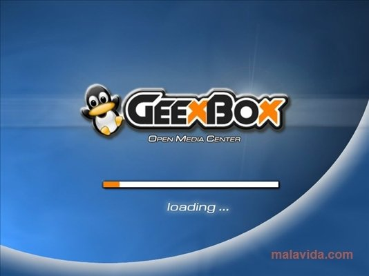
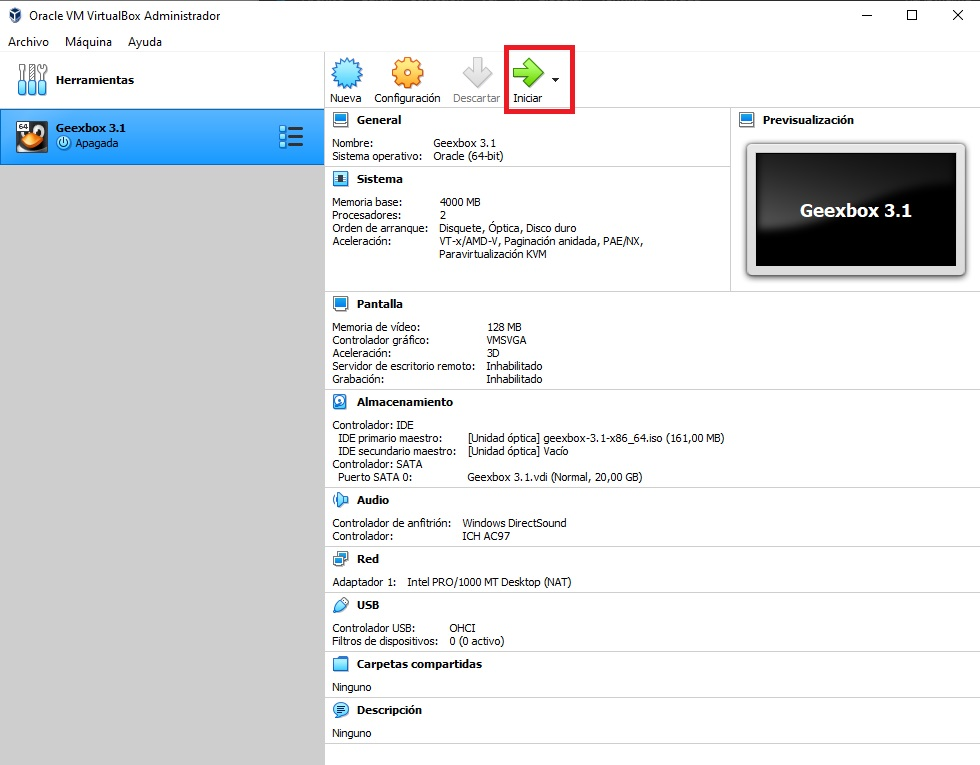
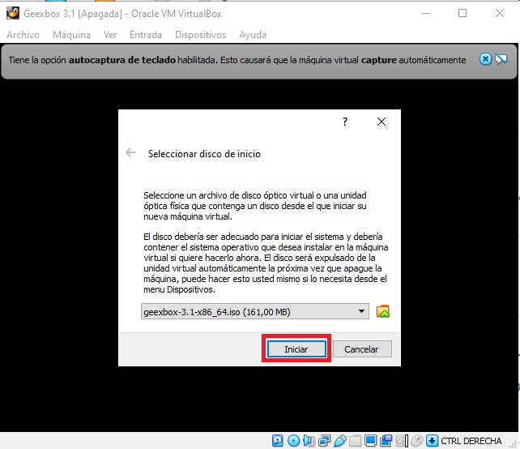
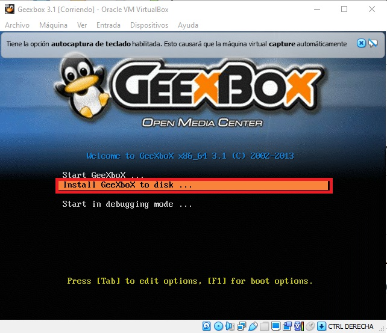
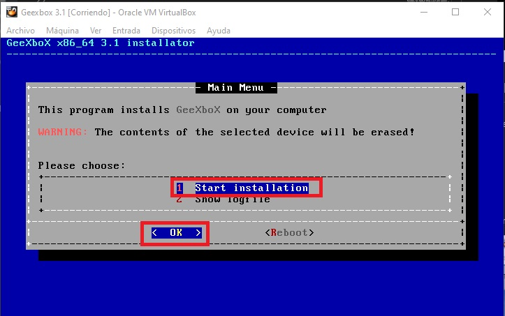
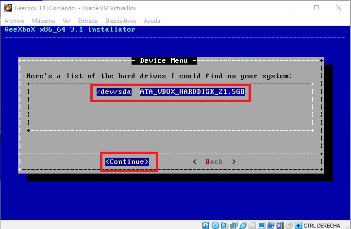
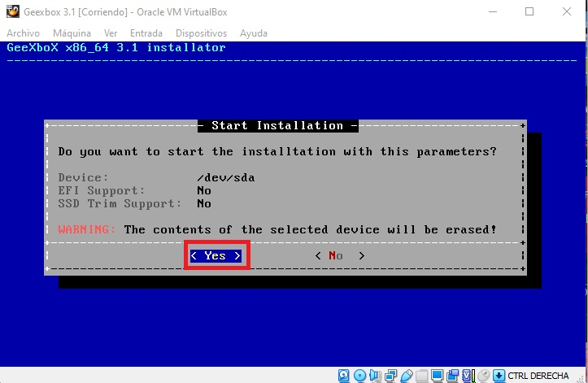
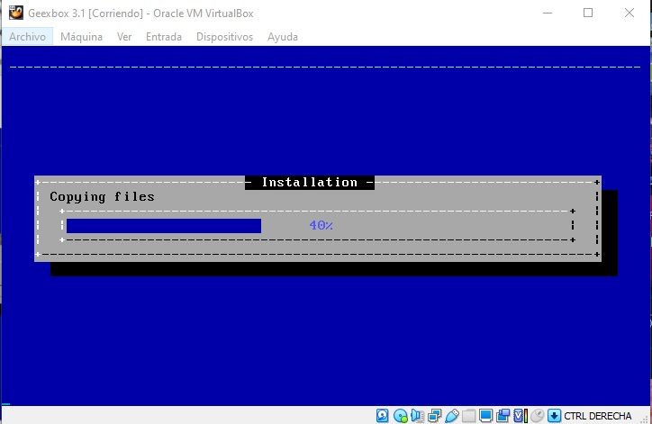

# <b>Geexbox 3.1</b>

<cite style="display:block; text-align: justify">[GeeXboX][1_0] es una minidistribución de Linux LiveCD instalable que tiene como objetivo convertir la computadora en Centro Multimedia. Está basado en Debian y corre sobre cualquier computadora x86 o PowerPC, no implicando ningún requisito de software. Puede utilizarse en ordenadores sin disco duro ya que el sistema entero se carga en memoria. También es posible instalarlo, ya sea en un disco local o incluso en un dispositivo de almacenamiento USB.

Extraoficialmente también existe un port de esta distribución compatible con la consola Wii, siendo uno de los primeros reproductores multimedia homebrew que permitieron la reproducción de contenido desde dispositivos de almacenamiento USB en esta consola.</cite>

[1_0]:https://es.wikipedia.org/wiki/GeeXboX

 

# <b>Proceso de instalación de Geexbox 3.1</b>

<cite style="display:block; text-align: justify">Una vez terminemos con la creación y configuración de nuestra maquina virtual, lo que prosigue es iniciar la Maquina virtual y terminar con la istalación.

el proceso de instalación no sera demorado.</cite>

 

# <b>Arranque inicial </b>

<cite style="display:block; text-align: justify">Arranque inicial desde la Máquina Virtual en VirtualBox con la ISO de Geexbox.

Al principio nos aparecera esta ventana, la cual nos pide que seleccionemos el disco de inicio, lo dejaremos como esta y le daremos iniciar. </cite>

 

# <b>Instalación</b>

<cite style="display:block; text-align: justify">Tenemos dos opciones

* Start GeeXboX: Al seleccionar esta opcion se iniciara Geexbox sin necesidad de instalación.

* Install GeeXboX to disk: Al seleccionar esta opción nos permitira instalar la Iso de Geexbox en nuestra maquina.

En nuestro caso instalaremos la ISO.</cite>

 

<cite style="display:block; text-align: justify">Iniciaremos la instalación y seleccionaremos el disco donde queremos que nuestra ISO se instale.

Como nosotros solo creamos un disco lo instalaremos en ese.</cite>

 

 

<cite style="display:block; text-align: justify">Le damos en YES y asi se iniciara la instalación.</cite>

# <b>Paso 9 - Reinicio</b>
